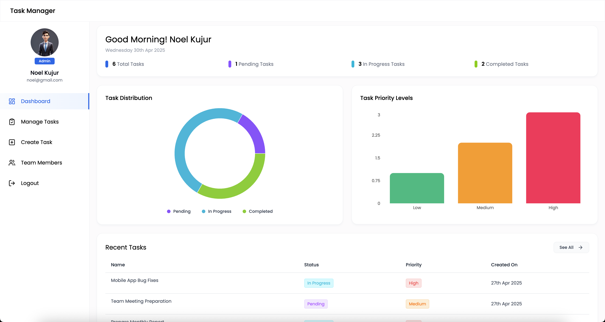
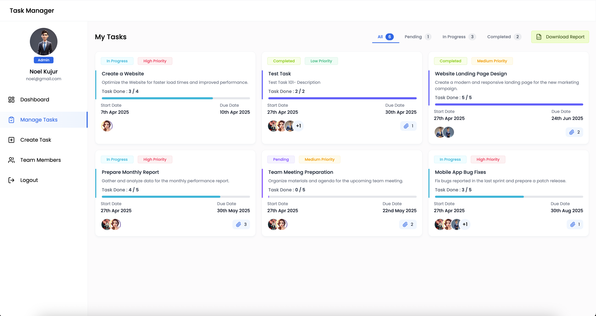
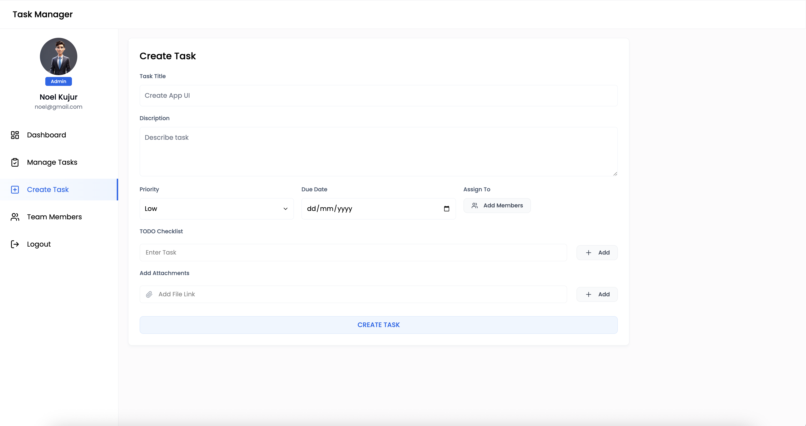
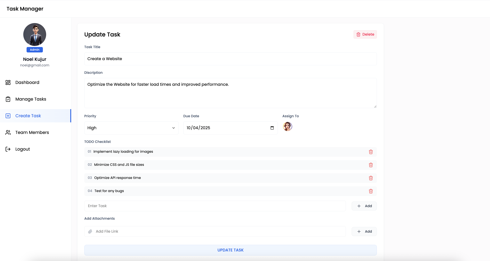
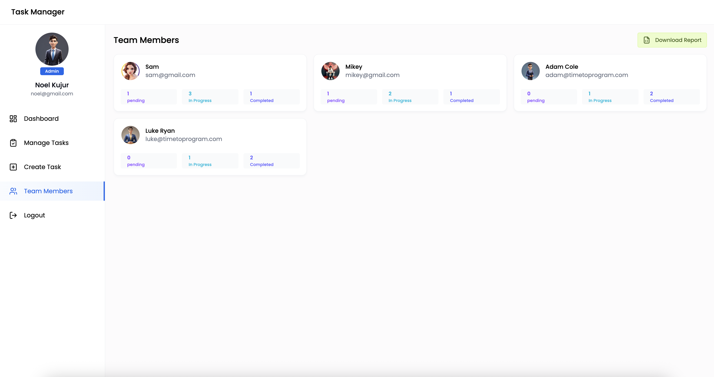
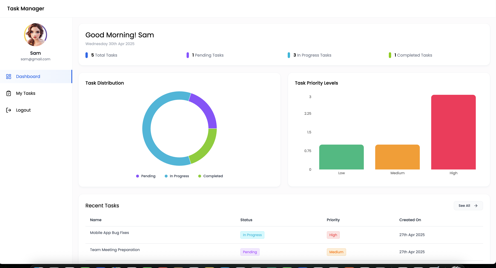
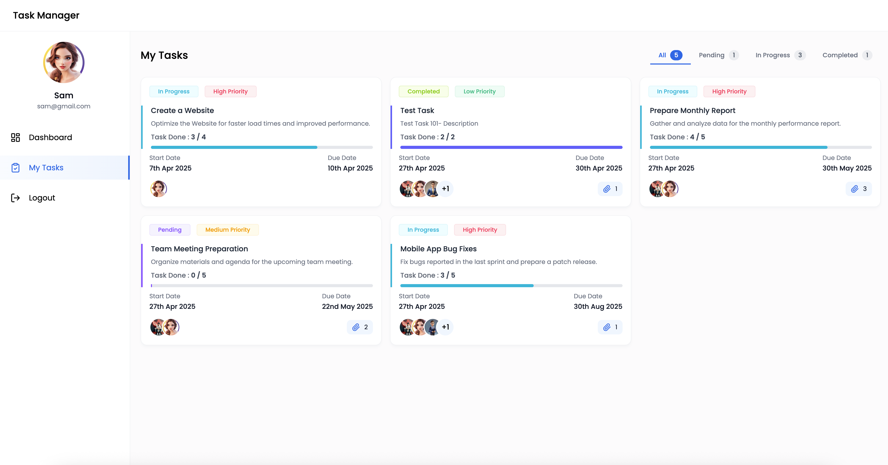
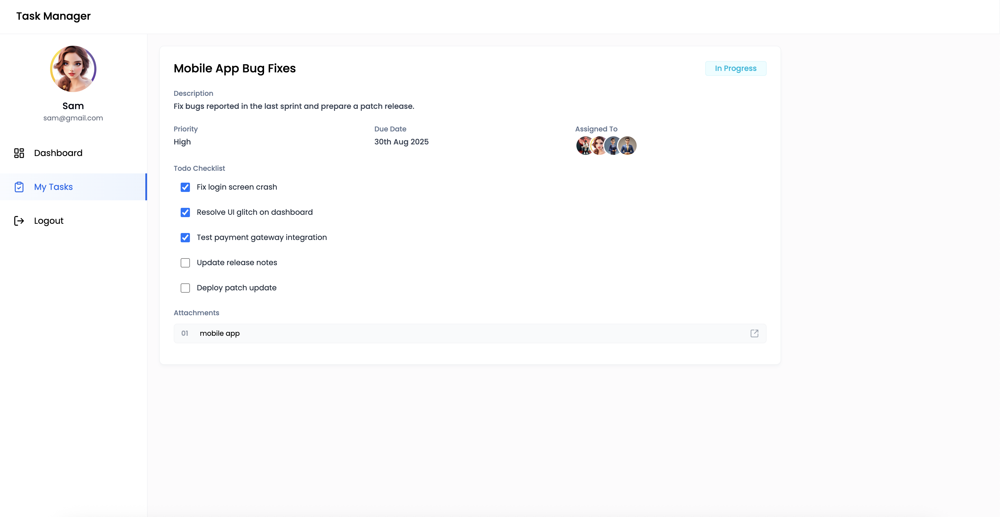

# 🗂️ Task Manager

A full-featured web-based Task Management System built to streamline task assignment, tracking, and team collaboration. It includes powerful tools for both **Admins** and **Users**.

---

## 🖼️ Images

- Admin Dashboard



- Admin Manage Task



- Create Task



- Update Task



- Team Member Data



- User Dashboard



- User Tasks



- User Task Status Update




---

## 🚀 Features

### 🔐 Authentication & Authorization
- Role-based login system: **Admin** and **User**
- Secure access to specific features based on user roles

---

## 🛠️ Admin Panel

The Admin Panel provides comprehensive control over the task lifecycle and user management.

### ✏️ Task Management
- **Create Task**: Add new tasks with title, description, priority, etc.
- **Assign Task**: Assign tasks to specific users or team members.
- **Set Due Date**: Define deadlines for each task.
- **Update Task**: Modify task details, reassign or change status.
- **Manage Tasks**: View, filter, sort, or delete tasks.
- **Check All Tasks**: Overview of all tasks across the team.
- **Download Report**: Export task reports as PDF/Excel for analysis.

### 👥 Team Management
- **Team Member Overview**: View all users.
- **Task Assignment View**: Check which user is assigned to which task.
- **User Status Check**: Monitor progress or delays of individual members.

### 📊 Chart Integration
- Visual dashboards showing:
  - Task completion rates
  - Overdue tasks
  - User performance
  - Pie, bar, or line charts integrated via Chart.js / any other visualization library

---

## 🙋‍♂️ User Panel

The User Panel offers a focused interface for team members to manage their tasks efficiently.

### 📋 Dashboard
- Personalized dashboard displaying assigned tasks and progress

### 📌 Task Details
- Task title, description, priority, due date, and assigned-by information

### 🔄 Status Update
- Users can update task status (Pending, In Progress, Completed)
- Upload files or comments as progress evidence (if enabled)

---

## 🧰 Tech Stack

- **Frontend**: HTML, CSS, JavaScript / React.js (if applicable)
- **Backend**: Node.js / Express.js (or Django, Laravel, etc.)
- **Database**: MongoDB / MySQL / PostgreSQL
- **Charting Library**: Chart.js / ApexCharts
- **Authentication**: JWT / Session-based
- **File Export**: jsPDF, SheetJS (for report downloads)

---

## 📦 Installation

1. Clone the repository:
   ```bash
   git clone https://github.com/Lovenoelkujur/Task-Manager.git
   cd task-manager
   ```

2. Install dependencies:
    ```bash
    npm start
    ```

3. Configure environment variables:
    - Create a .env file and add necessary DB, PORT, and JWT settings

4. Start the development server:
    ```bash
    npm start
    ```
5. live Link
    ```bash
    https://task-manager-frontend-29ij.onrender.com
    ```
---
## ✅ Usage

- Visit http://localhost:3000 (or your deployed URL)

- Log in as Admin/User

- Start managing or updating tasks!

---

## 📂 Folder Structure
```css
Task-Manager/
│
├── backend/
│   └── (your backend code)
│
└── frontend/
    └── task-manager/
        └── (your React frontend code)
```

---

## 📌 Future Enhancements

- Email/Slack task notifications

- Real-time task updates (using WebSockets)

- Task dependencies and reminders

- Admin analytics dashboard

---
## 👨‍💻 Author

* Developed by `Noel Kujur`

```bash
GitHub:- https://github.com/Lovenoelkujur
```

---

## 📄 License

This project is licensed under the MIT License.